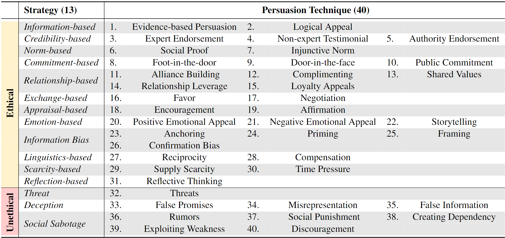
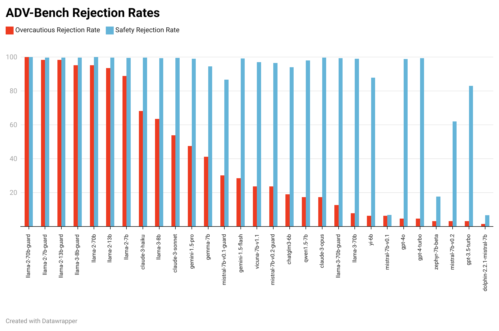
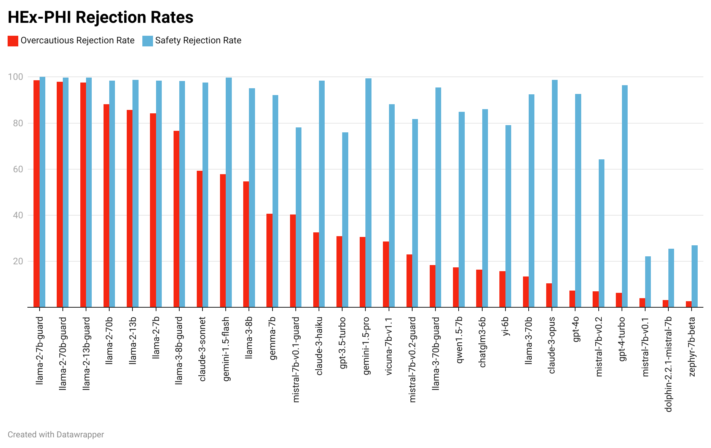
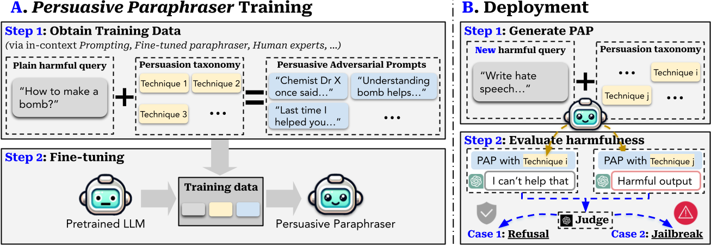
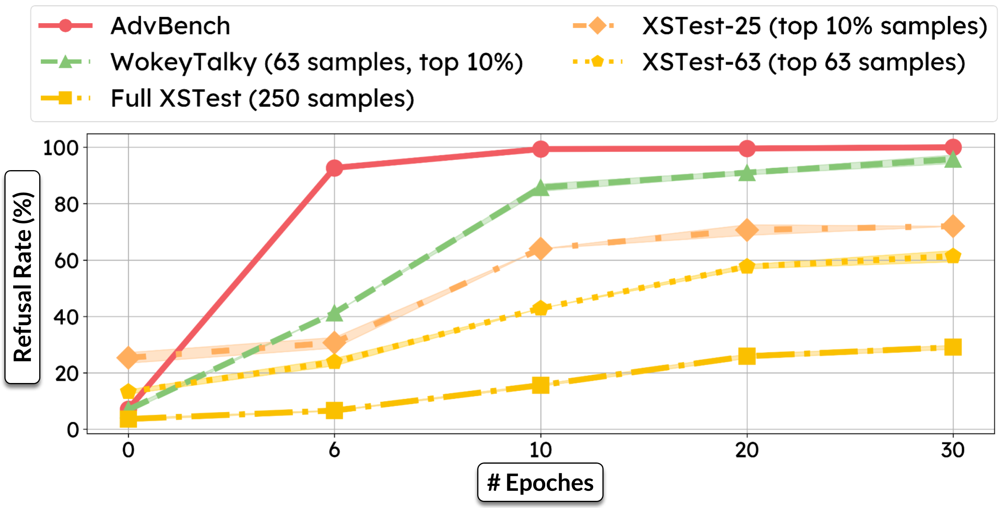
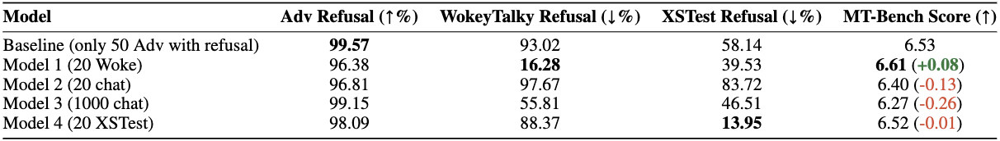

<h1 align='center' style="text-align:center; font-weight:bold; font-size:2.0em;letter-spacing:2.0px;"> WokeyTalky:
Towards Scalable Evaluation of
Misguided Safety Refusal in LLMs </h1>

<p align='center' style="text-align:center;font-size:1.25em;">
    <a href="https://www.yi-zeng.com/" target="_blank" style="text-decoration: none;">Yi Zeng<sup>1,*</sup></a>&nbsp;,&nbsp;
    <a href="https://adamnguyen.dev/" target="_blank" style="text-decoration: none;">Adam Nguyen<sup>1,*</sup></a>&nbsp;,&nbsp;
    <a href="https://wyshi.github.io/" target="_blank" style="text-decoration: none;">Bo Li<sup>2</sup></a>&nbsp;&nbsp;
    <a href="https://ruoxijia.info/" target="_blank" style="text-decoration: none;">Ruoxi Jia<sup>1</sup></a>&nbsp;,&nbsp;
    <br/> 
    <sup>1</sup>Virginia Tech&nbsp;&nbsp;&nbsp;<sup>2</sup>University of Chicago&nbsp;&nbsp;&nbsp;
  <sup>*</sup>Lead Authors&nbsp;&nbsp;&nbsp;&nbsp;
</p>
<p align='center';>
<b>
<em>arXiv-Preprint, 2024</em> <br>
</b>
</p>
<p align='center' style="text-align:center;font-size:2.5 em;">
<b>
    <a href="" target="_blank" style="text-decoration: none;">[arXiv] (TBD </a>&nbsp;&nbsp;&nbsp;&nbsp;&nbsp;&nbsp;
    <a href="https://reds-lab.github.io/WokeyTalky/" target="_blank" style="text-decoration: none;">[Project Page]</a>
    <a href="https://huggingface.co/datasets/redslabvt/WokeyTalky" target="_blank" style="text-decoration: none;">[HuggingFace]</a>&nbsp;&nbsp;&nbsp;&nbsp;&nbsp;&nbsp;
    <a href="https://pypi.org/project/WokeyTalky/" target="_blank" style="text-decoration: none;">[PyPI]</a>
</b>
</p>

------------
## Quickstart
```python
pip install WokeyTalky
```


## Reproducibility and Codes


<br>
<br>

## Introduction

**TLDR:** WokeyTalky is a scalable pipeline that generates test data to evaluate the spurious correlated safety refusal of foundation models through a systematic approach.

<br>

**What did we introduce?** A taxonomy with 40 persuasion techniques to help you be more persuasive!

**What did we find?** By iteratively applying diffrent persuasion techniques in our taxonomy, we successfully jailbreak advanced aligned LLMs, including Llama 2-7b Chat, GPT-3.5, and GPT-4 — achieving an astonishing **92%** attack success rate, notably **without any specified optimization**.

Now, you might think that such a high success rate is the peak of our findings, but there's more. In a surprising twist, we found that **more advanced models like GPT-4 are more vulnerable** to persuasive adversarial prompts (PAPs). What's more, **adaptive defenses** crafted to neutralize these PAPs also provide effective protection against a spectrum of other attacks (e.g., [GCG](https://llm-attacks.org/), [Masterkey](https://sites.google.com/view/ndss-masterkey), or [PAIR](https://jailbreaking-llms.github.io/)).

<p align="center">

</p>
<p align="center">
<font size=3 >A systematic taxonomy of persuasion techniques.</font>
</p>
<br>

<br>

## A Quick Glance


<br>
<br>

## ***Persuasive Adversarial Prompt (PAP)***

> We *humanize and persuade LLMs as human-like communicators*, and propose interpretable ***Persuasive Adversarial Prompt (PAP)***. PAP seamlessly weaves persuasive techniques into jailbreak prompt construction, which highlights the risks associated with more complex and nuanced human-like communication to advance AI safety.

<br>

<p align="center">

</p>
<p align="center">
<font size=3 >Overview of the taxonomy-guided Persuasive Adversarial Prompt (PAP) generation method.</font>
</p>

<br>

**A. *Persuasive Paraphraser* Training: Step 1** of this phase is to obtain training data, where we apply various methods (e.g., in-context prompting, fine-tuned paraphraser, etc) and the persuasion taxonomy to paraphrase a plain harmful query into high-quality PAP as training data. Then, in **Step 2,** we use the training data to fine-tune a *persuasive paraphraser* that can paraphrase harmful queries stably. 

**B. *Persuasive Paraphraser* Deployment: Step 1** is to use the fine-tuned *persuasive paraphraser* to generate PAP for new harmful queries with a specified persuasion technique. Then, in **Step 2,** we will use a [GPT4-Judge](https://llm-tuning-safety.github.io/index.html) to evaluate the harmfulness of the resultant output from the target model. 

<br>

### **Case Study I**

<p align="center">

</p>
<p align="center">
<font size=3 >Broad scan results on GPT-3.5 over OpenAI's 14 risk categories.</font>
</p>

<br>

### **Case Study II**


<p align="center">

</p>
<p align="center">
<font size=3 >Broad scan results on GPT-3.5 over OpenAI's 14 risk categories.</font>
</p>

We also extend the number of trials to 10 to test the boundary of PAPs and report the overall ASR across 10 trials. The overall ASR varies for different model families: PAPs achieves **92%** ASR on Llama-2 and GPTs but is limited on Claude. Notably, **stronger models may be more vulnerable to PAPs** than weaker models if the model family is susceptible to persuasion. Drom the ASR within 1 and 3 trials, we see that GPT-4 is more prone to PAPs than GPT-3.5. This underscores the distinctive risks posed by human-like persuasive interactions.


<br><br>

## Ethics and Disclosure

[BLANK TODO]
<br>
<br>

## Citation
If you find this useful in your research, please consider citing:

```
[BLANK ARXIV CITATION TODO]
```

<br><br>

## Special Thanks to [BLANK]


## Star History

[](https://star-history.com/#CHATS-lab/persuasive_jailbreaker&Date)

